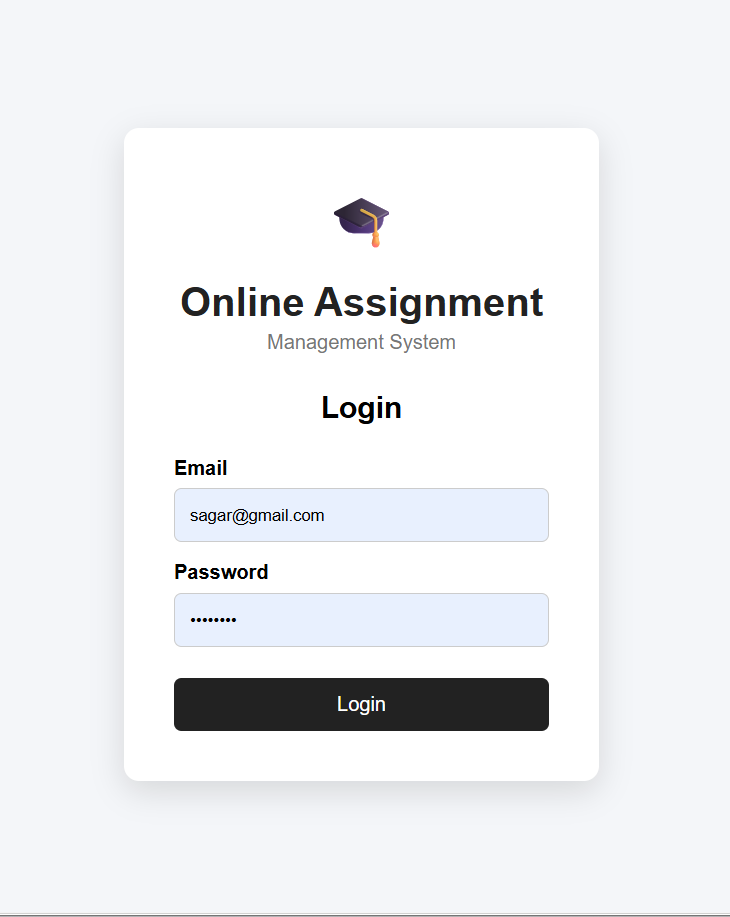
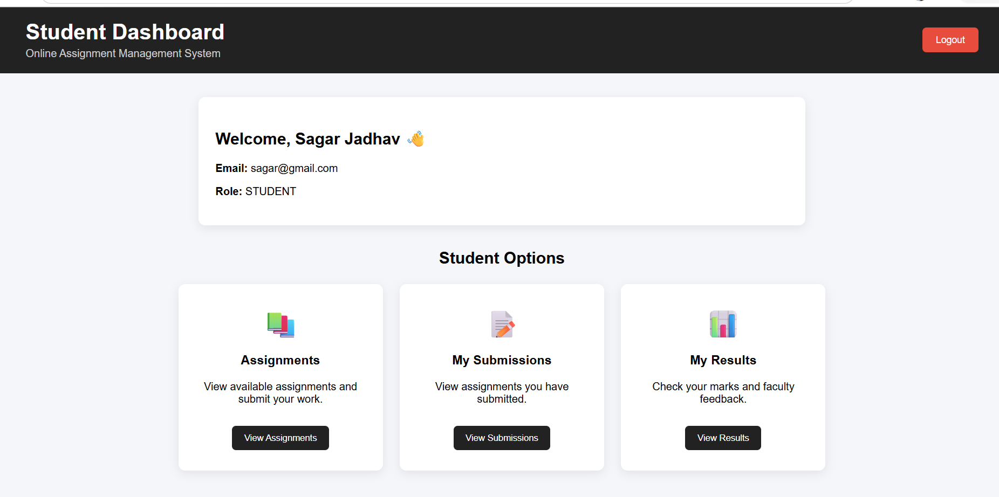
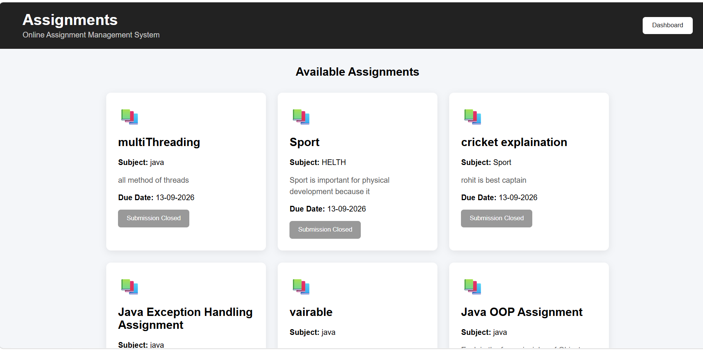
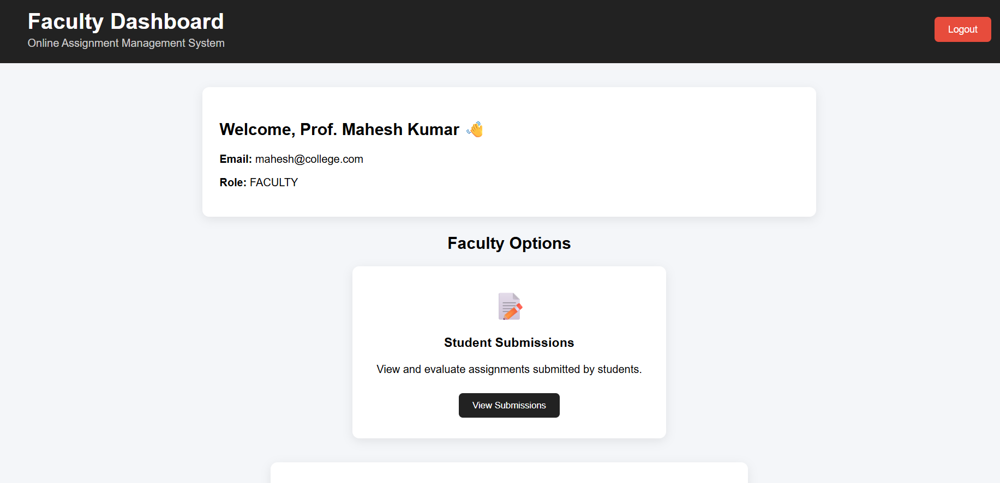

# Online Assignment Management System

A full-stack web application for managing student assignments, submissions, and evaluations.

## Technologies Used

### Frontend

* React JS
* HTML5
* CSS3
* JavaScript
* Vite

### Backend

* Java
* Spring MVC
* Maven
* JDBC

### Database

* Oracle Database
* SQL*Plus

## Features

### Student

* Secure Login
* User Registration
* View Assignments
* Submit Assignments
* View Submission Status
* View Results
* View Faculty Feedback

### Faculty

* Secure Login
* User Registration
* Create Assignments
* View Student Submissions
* Evaluate Assignments
* Publish Results

## Screenshots

### Login Page



### Student Dashboard



### Assignments



### Faculty Dashboard



## Project Structure

```text
Online-Assignment-Management-System
│
├── backend
│   └── assignment-system
│
├── frontend
│   └── assignment-frontend
│
├── screenshots
│   └── login.png
│
├── assignments.png
├── student-dashboard.png
├── faculty-dashboard.png
│
└── README.md
```

## Author

**Sagar Jadhav**

Java Developer Fresher | Java | Spring MVC | JDBC | Oracle | React JS
